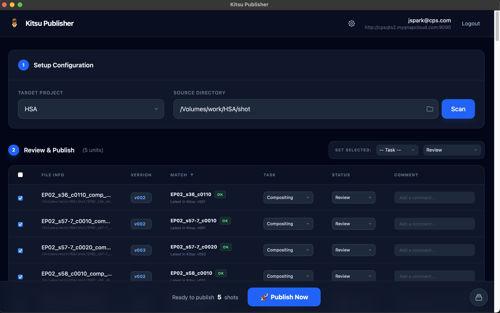

# Kitsu Publisher Desktop App

**Kitsu Publisher**는 CG/VFX 아티스트와 스튜디오를 위한 **CGWire Kitsu** 연동 데스크톱 애플리케이션입니다. 복잡한 파일 업로드 및 상태 업데이트 과정을 자동화하여 작업 효율을 극대화합니다.




### 주요 기능
- **일괄 업로드 (Batch Publishing)**: 여러 개의 리뷰 파일(Playblasts, Renders)을 한 번에 Kitsu에 업로드하고 상태를 업데이트합니다.
- **자동 매칭**: 파일명 패턴(예: `SQ01_SH100_Comp_v001.mov`)을 분석하여 Kitsu의 해당 에피소드, 시퀀스, 샷, 태스크와 자동으로 연결합니다.
- **커스텀 설정**: 스튜디오마다 다른 파일명 규칙을 자유롭게 설정할 수 있습니다.
- **통합 로깅**: 업로드 진행 상황과 오류를 직관적인 UI를 통해 실시간으로 확인합니다.
- **현대적인 UI/UX**: SvelteKit과 FastAPI 기반의 빠르고 미려한 데스크톱 인터페이스를 제공합니다.

이 프로젝트는 **SvelteKit** 프론트엔드와 **FastAPI(Python)** 백엔드로 구성되어 있으며, `pywebview`를 통해 데스크톱 애플리케이션으로 실행됩니다.

## 필수 요구 사항

- **Python 3.12+**
- **Node.js** 또는 **Bun**
- **uv** (최신 Python 패키지 매니저)

---

## 설치 가이드

### 1. `uv` 설치 (Python 패키지 매니저)
파이썬 환경 및 의존성 관리를 위해 `uv` 사용을 권장합니다.

- **macOS / Linux**:
  ```bash
  curl -LsSf https://astral.sh/uv/install.sh | sh
  ```
- **Windows**:
  ```powershell
  powershell -c "irm https://astral.sh/uv/install.ps1 | iex"
  ```

### 2. `bun` 설치 (JavaScript 런타임)
빠른 프론트엔드 빌드를 위해 `bun` 사용을 권장합니다.

- **macOS / Linux**:
  ```bash
  curl -fsSL https://bun.sh/install | bash
  ```
- **Windows**:
  ```powershell
  powershell -c "irm https://bun.sh/install.ps1 | iex"
  ```

---

## 빠른 실행 (개발 & 테스트)

`uv`를 사용하면 별도의 가상 환경 설정 없이 바로 실행할 수 있습니다.

### 1. 데스크톱 앱 실행 (통합 모드)
프론트엔드 빌드 파일이 있어야 합니다 (`frontend/build`).

```bash
# 프론트엔드 빌드 (최초 1회 또는 변경 시)
cd frontend && bun install && bun run build && cd ..

# 데스크톱 앱 실행
uv run backend/desktop.py
```

### 2. 개발 서버 실행 (라이브 리로드)
소스 코드를 수정하면서 바로 확인하려면 두 개의 터미널을 사용하세요.

**터미널 1: 백엔드 API 서버**
```bash
uv run uvicorn main:app --app-dir backend --reload --port 8000
```

**터미널 2: 프론트엔드 개발 서버**
```bash
cd frontend
bun run dev
```
브라우저에서 `http://localhost:5173`으로 접속합니다.

---

## 아이콘 생성
로고 이미지(`frontend/img/kitsu_publisher.png`)를 변경했다면, 다음 명령어로 앱 아이콘과 파비콘을 재생성하세요.

```bash
uv run backend/generate_icons.py
```

---

## 앱 배포 (빌드 가이드)

소스 코드를 단일 실행 파일(`.app`)로 패키징하는 방법입니다.

### 1. 프론트엔드 빌드
```bash
cd frontend
bun install
bun run build
cd ..
```

### 2. 실행 파일 생성 (PyInstaller)
`uv` 환경 내에서 PyInstaller를 실행하여 빌드합니다.

```bash
cd backend
uv run pyinstaller --noconsole --onefile --name "KitsuPublisher" --icon="icon.icns" --add-data "../frontend/build:frontend/build" --clean desktop.py # MAC
uv run pyinstaller --noconsole --onefile --name "KitsuPublisher" --icon="icon.icns" --add-data "../frontend/build;frontend/build" --clean desktop.py # WINDOWS
```

### 3. 결과물 확인
빌드가 완료되면 `backend/dist/` 폴더에 실행 파일이 생성됩니다.

- **macOS**: `backend/dist/KitsuPublisher.app`
- **CLI**: `backend/dist/KitsuPublisher`

```bash
open backend/dist/KitsuPublisher.app
```