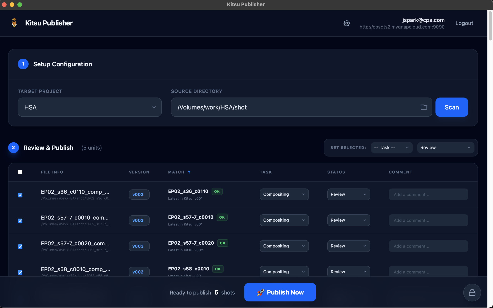

# Kitsu Publisher Desktop App

**Kitsu Publisher**는 CG/VFX 아티스트와 스튜디오를 위한 **CGWire Kitsu** 연동 데스크톱 애플리케이션입니다. 복잡한 파일 업로드 및 상태 업데이트 과정을 자동화하여 작업 효율을 극대화합니다.




### 주요 기능
- **일괄 업로드 (Batch Publishing)**: 여러 개의 리뷰 파일(Playblasts, Renders)을 한 번에 Kitsu에 업로드하고 상태를 업데이트합니다.
- **자동 매칭**: 파일명 패턴(예: `SQ01_SH100_Comp_v001.mov`)을 분석하여 Kitsu의 해당 에피소드, 시퀀스, 샷, 태스크와 자동으로 연결합니다.
- **FTP / SFTP 전송**: EXR, DPX 시퀀스 폴더와 MOV 파일을 프로젝트별로 설정된 FTP/SFTP 서버로 전송합니다. 전송 성공 후 Kitsu 퍼블리시가 자동으로 이어집니다.
- **커스텀 설정**: 스튜디오마다 다른 파일명 규칙을 자유롭게 설정할 수 있습니다. 프로젝트별로 별도 설정도 가능합니다.
- **통합 로깅**: 업로드 및 전송 진행 상황과 오류를 직관적인 UI를 통해 실시간으로 확인합니다.
- **현대적인 UI/UX**: SvelteKit과 FastAPI 기반의 빠르고 미려한 데스크톱 인터페이스를 제공합니다.

이 프로젝트는 **SvelteKit** 프론트엔드와 **FastAPI(Python)** 백엔드로 구성되어 있으며, `pywebview`를 통해 데스크톱 애플리케이션으로 실행됩니다.

## 필수 요구 사항

- **Python 3.12+**
- **Node.js** 또는 **Bun**
- **uv** (최신 Python 패키지 매니저)

---

## 설치 가이드

### 1. `uv` 설치 (Python 패키지 매니저)
파이썬 환경 및 의존성 관리를 위해 `uv` 사용을 권장합니다.

- **macOS / Linux**:
  ```bash
  curl -LsSf https://astral.sh/uv/install.sh | sh
  ```
- **Windows**:
  ```powershell
  powershell -c "irm https://astral.sh/uv/install.ps1 | iex"
  ```

### 2. `bun` 설치 (JavaScript 런타임)
빠른 프론트엔드 빌드를 위해 `bun` 사용을 권장합니다.

- **macOS / Linux**:
  ```bash
  curl -fsSL https://bun.sh/install | bash
  ```
- **Windows**:
  ```powershell
  powershell -c "irm https://bun.sh/install.ps1 | iex"
  ```

---

## 빠른 실행 (개발 & 테스트)

`uv`를 사용하면 별도의 가상 환경 설정 없이 바로 실행할 수 있습니다.

### 1. 데스크톱 앱 실행 (통합 모드)
프론트엔드 빌드 파일이 있어야 합니다 (`frontend/build`).

```bash
# 프론트엔드 빌드 (최초 1회 또는 변경 시)
cd frontend
bun install
bun run build

# 데스크톱 앱 실행
uv run backend/desktop.py
```

### 2. 개발 서버 실행 (라이브 리로드)
소스 코드를 수정하면서 바로 확인하려면 두 개의 터미널을 사용하세요.

**터미널 1: 백엔드 API 서버**
```bash
uv run uvicorn main:app --app-dir backend --reload --port 8000
```

**터미널 2: 프론트엔드 개발 서버**
```bash
cd frontend
bun run dev
```
브라우저에서 `http://localhost:5173`으로 접속합니다.

---

## FTP / SFTP 설정 가이드

프로젝트별로 FTP 또는 SFTP 서버를 설정하면, Kitsu 퍼블리시와 함께 파일을 자동으로 전송할 수 있습니다.

### 설정 방법

1. **Settings** 페이지에서 우측 상단의 **Target Project** 드롭다운으로 특정 프로젝트를 선택합니다.
2. **File Transfer Settings** 섹션에서 **Enable FTP Transfer** 토글을 켭니다.
3. 아래 정보를 입력합니다:
   - **Protocol**: `SFTP` (SSH 기반, 포트 22 기본) 또는 `FTP` (포트 21 기본)
   - **Host / IP**: 서버 주소 (예: `192.168.1.100`, `ftp.example.com`)
   - **Port**: 서버 포트
   - **Username / Password**: 인증 정보
4. **Test Connection** 버튼으로 연결을 확인합니다.
5. **Save Project Settings** 버튼으로 저장합니다.

### 전송 워크플로우

FTP가 활성화된 프로젝트에서 퍼블리시하면 다음 순서로 진행됩니다:

```
[Transfer + Publish 클릭]
        ↓
[FTP 목적지 폴더 선택 (Tree View)]
        ↓
[FTP/SFTP 전송]  ←  실패 시 해당 항목은 Kitsu 퍼블리시 건너뜀
        ↓
[Kitsu 퍼블리시]  ← FTP 성공한 항목만
```

### 전송 대상 파일

- **MOV 파일**: 스캔된 개별 파일
- **EXR / DPX 시퀀스**: 같은 디렉토리 또는 하위 폴더에서 시퀀스 파일이 포함된 폴더를 자동으로 감지하여 함께 전송합니다.

> **참고**: FTP 설정은 전역(Global)이 아닌 **프로젝트별**로만 저장됩니다.

---

## 아이콘 생성
로고 이미지(`frontend/img/kitsu_publisher.png`)를 변경했다면, 다음 명령어로 앱 아이콘과 파비콘을 재생성하세요.

```bash
uv run backend/generate_icons.py
```

---

## 앱 배포 (빌드 가이드)

소스 코드를 단일 실행 파일(`.app`)로 패키징하는 방법입니다.

### 빌드 스크립트 사용 (권장)

루트 디렉토리의 `build.sh`를 실행하면 프론트엔드 빌드와 앱 패키징이 한 번에 진행됩니다.

```bash
./build.sh
```

---

### 수동 빌드

#### 1. 프론트엔드 빌드
```bash
cd frontend
bun install
bun run build
cd ..
```

#### 2. 실행 파일 생성 (PyInstaller)
`backend/KitsuPublisher.spec` 파일을 사용하여 OS 및 버전에 맞는 실행 파일을 생성합니다.

```bash
cd backend
uv run pyinstaller KitsuPublisher.spec
```

### 결과물 확인
빌드가 완료되면 `backend/dist/` 폴더에 OS와 버전 정보가 포함된 이름으로 실행 파일이 생성됩니다.

- **macOS**: `backend/dist/KitsuPublisher_macOS_vX.X.X.app`
- **Windows**: `backend/dist/KitsuPublisher_windows_vX.X.X.exe`

*참고: 버전 정보는 `backend/version.py`에서 관리됩니다.*

```bash
open backend/dist/KitsuPublisher.app
```
